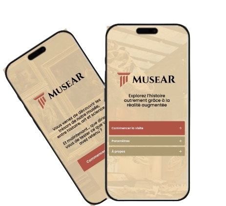
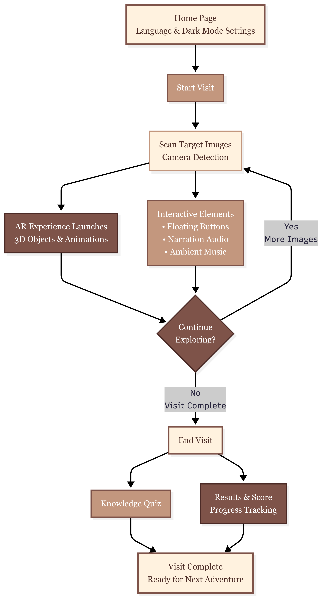

# ARmuseumAPP
# 🏛️ MuseAR — Augmented Reality Museum

**MuseAR** is a mobile augmented reality (AR) application that transforms any space into a rich, interactive museum experience. Designed to make cultural heritage accessible, immersive, and engaging, MuseAR allows users to explore 3D models of dinosaurs, ancient artifacts, art, and scientific innovations right from their device.

 

---

## 📲 Download & Try It

> 💡 Print the **target images** and scan them using the app to trigger 3D AR content!

- **📥 Download the APK**: [MuseAR App](https://your-download-link.com)  
- **🖼️ Download the target images**: [Target Images Folder](https://drive.google.com/drive/folders/1JUUThCjd6cHNbs52oVQeagDx-QfrtB4f?usp=drive_link)  
- **🧾 Poster of the App**:  
  

---

## 🧭 How It Works

MuseAR uses Vuforia's AR engine to recognize printed images and overlay them with dynamic 3D content. Here's a simplified workflow:

1. Launch the app and configure language / dark mode.
2. Scan printed target images using your phone's camera.
3. View 3D objects with sound, interaction, and animations.
4. Complete quizzes at the end of your virtual museum visit.

---

## 🧠 What You'll Discover

MuseAR includes **17+ high-quality 3D models**, categorized into:

| Section                  | Number of Models |
|--------------------------|------------------|
| 🦖 Prehistoric Era       | 4 models         |
| 🏺 Ancient Civilizations | 4 models         |
| 🎨 Art Gallery           | 6 models         |
| ⚙️ Scientific Innovations | 3 models         |

> All models are interactively narrated, true-to-scale, and contextualized with soundscapes.

---

## 🧩 Technologies Used

- **Unity 3D** + **Vuforia Engine** (Augmented Reality)
- **Sketchfab** (3D Assets)
- **ElevenLabs** (Voice Narration)
- **Figma** (UI/UX Design)
- **Visual Studio + C#**

---

## 📌 Try It Now

> Just print the targets, install the APK on your Android phone, and enjoy the tour.  
> 📢 **No headset needed. Works with your camera and phone!**

---

## Team Members

| Name             | Email                                            |
| ---------------- | ------------------------------------------------ |
| Fadia Boudiaf    | [lf\_boudiaf@esi.dz](mailto:lf_boudiaf@esi.dz)   |
| Wifak Herkat     | [lw\_herkat@esi.dz](mailto:lw_herkat@esi.dz)     |
| Marwa Zoutat     | [lm\_zoutat@esi.dz](mailto:lm_zoutat@esi.dz)     |
| Yasmine Larbaoui | [ky\_larbaoui@esi.dz](mailto:ky_larbaoui@esi.dz) |
| Hiba Hamed       | [lh\_hamed@esi.dz](mailto:lh_hamed@esi.dz)       |
| Mohamed Merabet  | [lm\_merabet@esi.dz](mailto:lm_merabet@esi.dz)   |
 
***Module RV – Réalité Virtuelle Groupe SIQ1 ESI (École nationale supérieure d'informatique)***
---

## 📬 Contact & Feedback

If you encounter bugs or have feature suggestions, feel free to open an issue or contact us via [email].

---

